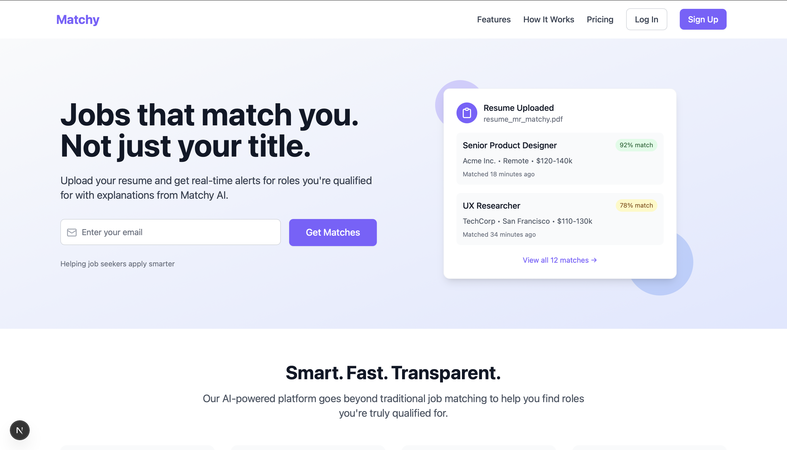

# Matchy AI – Landing Page



> **Live Preview:** Coming soon on [matchyai.org](https://matchyai.org)

A responsive, clean, and modern landing page for Matchy AI — a job matching platform that analyzes resumes and shows users high-fit job opportunities, explaining exactly why they’re a match.

## ✨ Features
- Responsive layout (mobile-first)
- Animated gradient backgrounds
- Custom UI components (Buttons, Icons)
- Sectioned layout: Hero, Features, Explainer, Testimonials, Pricing, Footer
- Built with [Next.js](https://nextjs.org/) and [Tailwind CSS](https://tailwindcss.com/)

## 📁 Tech Stack
- **Framework:** Next.js (Pages Router)
- **Styling:** Tailwind CSS v3
- **Icons:** Lucide React
- **Deployment:** Vercel (optional)

## 🚀 Getting Started
```bash
git clone https://github.com/amaanomo/matchyai-landing.git
cd matchyai-landing
npm install
npm run dev
```

Visit: [http://localhost:3000](http://localhost:3000)

## 📸 Screenshot


## 🧠 Future Plans
- Add form logic to collect emails
- Hook up signup/authentication flow
- Scroll animations and transitions
- Deploy publicly to Vercel

## 📝 License
This project is licensed under the [MIT License](./LICENSE).
